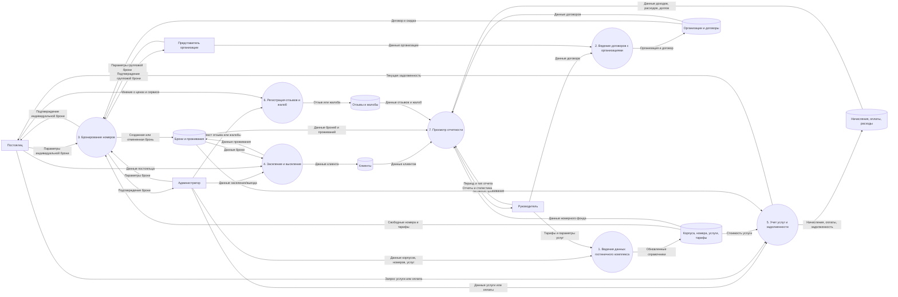

### Диаграмма потоков данных

```mermaid
flowchart LR
    Guest[Постоялец]
    Admin[Администратор]
    Org[Представитель организации]
    Manager[Руководитель]

    P1((1. Ведение данных гостиничного комплекса))
    P2((2. Ведение договоров с организациями))
    P3((3. Бронирование номеров))
    P4((4. Заселение и выселение))
    P5((5. Учет услуг и задолженности))
    P6((6. Регистрация отзывов и жалоб))
    P7((7. Просмотр отчетности))

    D1[(Корпуса, номера, услуги, тарифы)]
    D2[(Организации и договоры)]
    D3[(Клиенты)]
    D4[(Брони и проживания)]
    D5[(Начисления, оплаты, расходы)]
    D6[(Отзывы и жалобы)]

    Admin -->|Данные корпусов, номеров, услуг| P1
    Manager -->|Тарифы и параметры услуг| P1
    P1 -->|Обновленные справочники| D1

    Manager -->|Данные договора| P2
    Org -->|Данные организации| P2
    P2 -->|Организация и договор| D2

    Admin -->|Параметры брони| P3
    Org -->|Параметры групповой брони| P3
    Guest -->|Параметры индивидуальной брони| P3
    D1 -->|Свободные номера и тарифы| P3
    D2 -->|Договор и скидка| P3
    P3 -->|Созданная или отмененная бронь| D4
    P3 -->|Подтверждение брони| Admin
    P3 -->|Подтверждение групповой брони| Org
    P3 -->|Подтверждение индивидуальной брони| Guest

    Admin -->|Данные заселения/выезда| P4
    Guest -->|Данные постояльца| P4
    D4 -->|Данные брони| P4
    P4 -->|Данные клиента| D3
    P4 -->|Данные проживания| D4

    Admin -->|Данные услуги или оплаты| P5
    Guest -->|Запрос услуги или оплата| P5
    D1 -->|Стоимость услуги| P5
    D4 -->|Активное проживание| P5
    P5 -->|Начисления, оплаты, задолженность| D5
    P5 -->|Текущая задолженность| Guest

    Admin -->|Текст отзыва или жалобы| P6
    Guest -->|Мнение о ценах и сервисе| P6
    P6 -->|Отзыв или жалоба| D6

    Manager -->|Период и тип отчета| P7
    D1 -->|Данные номерного фонда| P7
    D2 -->|Данные договоров| P7
    D3 -->|Данные клиентов| P7
    D4 -->|Данные броней и проживаний| P7
    D5 -->|Данные доходов, расходов, долгов| P7
    D6 -->|Данные отзывов и жалоб| P7
    P7 -->|Отчеты и статистика| Manager
```

[Назад к SRS >>](srs-0.md)
