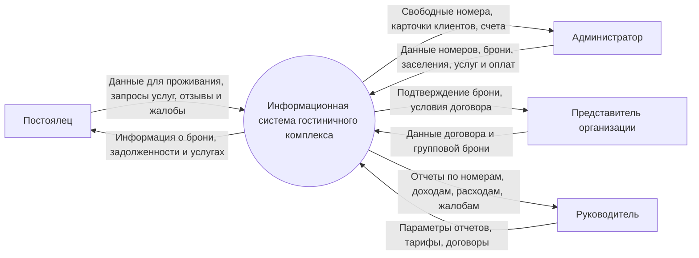

## Контекстная диаграмма

```mermaid
flowchart LR
    Guest[Постоялец]
    Admin[Администратор]
    Org[Представитель организации]
    Manager[Руководитель]

    System((Информационная система гостиничного комплекса))

    Guest -->|Данные для проживания, запросы услуг, отзывы и жалобы| System
    System -->|Информация о брони, задолженности и услугах| Guest

    Admin -->|Данные номеров, брони, заселения, услуг и оплат| System
    System -->|Свободные номера, карточки клиентов, счета| Admin

    Org -->|Данные договора и групповой брони| System
    System -->|Подтверждение брони, условия договора| Org

    Manager -->|Параметры отчетов, тарифы, договоры| System
    System -->|Отчеты по номерам, доходам, расходам, жалобам| Manager
```

[Назад к SRS >>](srs-0.md)
