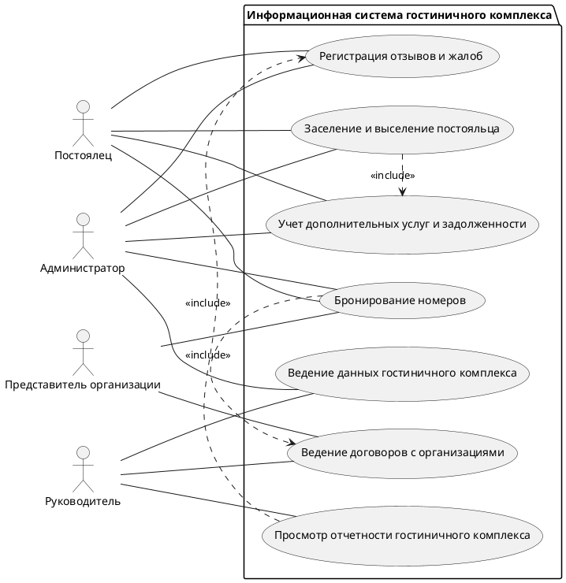

### Диаграмма вариантов использования

```plantuml
@startuml
left to right direction

actor Постоялец as Guest
actor Администратор as Admin
actor "Представитель организации" as Org
actor Руководитель as Manager

package "Информационная система гостиничного комплекса" {
  (Ведение данных гостиничного комплекса) as UC1
  (Ведение договоров с организациями) as UC2
  (Бронирование номеров) as UC3
  (Заселение и выселение постояльца) as UC4
  (Учет дополнительных услуг и задолженности) as UC5
  (Регистрация отзывов и жалоб) as UC6
  (Просмотр отчетности гостиничного комплекса) as UC7
}

Admin -- UC1
Manager -- UC1
Manager -- UC2
Org -- UC2
Admin -- UC3
Org -- UC3
Guest -- UC3
Admin -- UC4
Guest -- UC4
Admin -- UC5
Guest -- UC5
Admin -- UC6
Guest -- UC6
Manager -- UC7

UC3 .> UC2 : <<include>>
UC4 .> UC5 : <<include>>
UC7 .> UC6 : <<include>>
@enduml
```

[Назад к SRS >>](srs-0.md)
